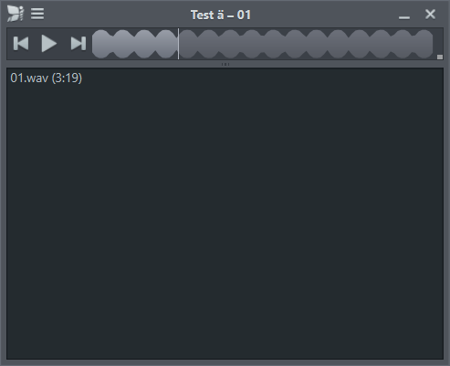

# Phase 1: Qt-6-Skin-Prototyp

Stand: 6. September 2026. Arbeitszweig: `codex/phase-1-qt6-skins`, aufgebaut auf Phase-0-Commit `99f26ae`.

Der Prototyp lädt die vorhandenen Nulloy-Skins mit Qt 6.11.2 und QJSEngine. Formulare, Skripte und Grafiken wurden nicht umgestaltet. Slim wurde zuerst geprüft, danach Native, Silver und Metro. Zusätzlich bestehen die kopierten Slim-, Silver- und Metro-Pakete der installierten Version 0.9.9 die Tests.

## Nachweise zur Phase-1-Liste

| Anforderung | Nachweis |
| --- | --- |
| QtScript und private Qt-APIs inventarisieren | [Quellinventar](docs/phase1/source-inventory.json), reproduzierbar mit `experiments/qt6-skins/inventory.py`. Es erfasst Anwendung, Skins und mitgelieferte Drittquellen, einschließlich inaktiver Plattformzweige und Kommentar-Treffer. Die Bewertung steht in der Architekturentscheidung. |
| Vorhandene Formulare und Widgets unter Qt 6 laden | `OriginalWidgetLoader` verwendet die tatsächlichen Nulloy-Klassen und NMainWindow. `test_skin_runtime` prüft alle vier Quell-Skins als Verzeichnis und NZS sowie die drei 0.9.9-Pakete. |
| QJSEngine-Funktionen nachweisen | Globals, Enums, Signal-Signaturen, Methodenbindung, Layout-/Widget-Adapter, Splitter-Listen, Punkte, Margins, print, Fonts und Bildmasken werden ausgeführt und geprüft. Skriptfehler und fehlende Ressourcen lassen die Integrationstests scheitern. |
| Aktiven Skin und weitere Skins prüfen | Elf Skin-Laufzeitfälle unter dem Windows-Plugin. Play/Pause, Titel, Menü-Koordinaten, Controls, Vollbild, Maximierung, Splitter und Metro-Themes werden geprüft. |
| Öffentlichen Ressourcenweg nachweisen | QDir-Suchpfade mit temporärem Overlay; Stored/Deflate, Data-Descriptors, verschachtelte Pfade, CRC-Prüfung, getrennte Sessions, Masken und Font-Laden geprüft. |
| Alt-Abhängigkeiten prüfen | QtIOCompressor wird unverändert tatsächlich genutzt. Separate Compilerproben zeigen QRegExp bei QtSingleApplication und den falschen Ergebniszeiger bei Qxt. Windows-Fenster und Taskleisten-Code kompilieren im Testaufbau. |
| Zielversionen und Migrationsweg festlegen | [Architekturentscheidung](docs/phase1/DECISION.md) und [Werkzeugketten-Snapshot](docs/phase1/toolchain.json). |

## Testergebnisse

| Programm | Bestandene Fälle einschließlich Initialisierung/Abschluss |
| --- | ---: |
| ScriptBridgeTest | 6 |
| SkinResourceTest | 21 |
| SkinRuntimeTest | 13 |
| TestFileDrop, bestehender Phase-0-Test mit Qt 6 | 6 |
| Gesamt | 46, keine Fehler oder übersprungenen Fälle |

Das entspricht 38 eigentlichen Testfällen plus acht Initialisierungs-/Abschlussfällen. Ein sauberer Build wurde mit dem beigefügten PowerShell-Skript in einem neuen Verzeichnis durchgeführt. Die geänderten Produktionsquellen kompilieren zusätzlich mit Qt 5.15.19. Diese Qt-5-Prüfung ist ein Compile-Nachweis, kein erneut durchgeführter kompletter Player-Laufzeittest.

Die eingecheckten [Prüfprotokolle](docs/phase1/results) dokumentieren diesen Lauf. Das [Abhängigkeitsprotokoll](docs/phase1/results/dependencies.txt) nennt die erwarteten Compilerfehler der noch nicht migrierten Bibliotheken.

Die [Windows-Renderings](docs/phase1/screenshots) zeigen die tatsächlichen Widgets mit einem Testtitel und synthetischen Peaks. Sie erfassen den Fensterinhalt; die vom Betriebssystem gezeichnete Native-Titelleiste ist nicht Bestandteil eines QWidget-Renderings. Die Rückkehr zur ursprünglichen Fenstergröße nach Vollbild und Maximierung wird zusätzlich automatisch geprüft.



Die Drag-and-drop-Fälle decken einzelne und mehrere Dateien in leeren und bestehenden Playlists ab, einschließlich Reihenfolge, Dateierhalt und Unicode-Pfaden. Es handelt sich um Qt-Ereignistests. Der manuelle Explorer-Test aus Phase 0 wird dadurch nicht als neuer manueller Qt-6-Test ausgegeben.

## Bauen und ansehen

Voraussetzung ist eine getrennte MSYS2-MINGW64-Installation mit den in `toolchain.json` dokumentierten Paketen. Benötigt werden Qt 6 Base, Declarative, Tools, SVG, GCC, CMake, Ninja, zlib und Python. Qt6-5Compat ist in der lokalen Installation vorhanden, wird vom Prototyp jedoch nicht benötigt.

```powershell
./tools/phase1/build-prototype.ps1 `
  -ToolchainRoot 'E:/Temp/NulloyPhase0-01a0773b/msys64' `
  -ReferenceSkinDirectory 'D:/Benutzer Dateien/Benutzer/ChatGPT/Nulloy-Fork/.phase0/reference/installed-0.9.9/Skins'
```

Ohne lokale Referenzkopie den zweiten Parameter weglassen. Build und temporäre Testdaten liegen standardmäßig unter `.phase1/build` und werden nicht eingecheckt. Die Testprotokolle stehen dort in `*-results.txt`, die gerenderten Bilder in `fixtures/*.png`.

Für die Ansicht den DLL-Pfad nur im aktuellen Prozess ergänzen und den Prototyp mit einem Skin-Verzeichnis oder `.nzs` starten:

```powershell
$previousPath = $env:PATH
try {
  $env:PATH = 'E:/Temp/NulloyPhase0-01a0773b/msys64/mingw64/bin;' + $previousPath
  & './.phase1/build/skin_probe.exe' './src/skins/slim'
} finally {
  $env:PATH = $previousPath
}
```

Der Prototyp zeigt eine synthetische Waveform. Play/Pause, Fenstersteuerung und F11 dienen der Skin-Prüfung; er ist noch kein Musikplayer. Einstellungen landen in einem eigenen temporären Profil.

## Was als Nächstes offen bleibt

Phase 2 baut den vollständigen Player mit CMake und derselben x64-Toolchain. Die konkreten Schritte für QtSingleApplication, Hotkeys, Icons und Taskleiste stehen in der Architekturentscheidung. Der vollständige UI-Vergleich einschließlich HiDPI, vorhandener Silver-Sonderfälle und echter Start-/Waveform-Zeiten gehört zur vollständigen Migration. Die Phase-1-Prüfung behauptet keine pixelidentische oder alltagstaugliche Player-Abnahme.
